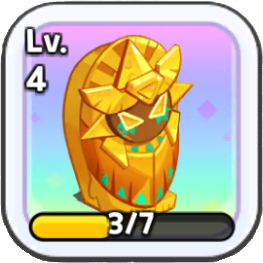

<!-- CREDIT FOR README TEMPLATE TO https://github.com/othneildrew/ -->

<a name="readme-top"></a>


[![Contributors][contributors-shield]][contributors-url]
[![Forks][forks-shield]][forks-url]
[![Stargazers][stars-shield]][stars-url]
[![Issues][issues-shield]][issues-url]


<!-- PROJECT LOGO -->
<br />
<div align="center">
  <a href="https://github.com/vinlyau/crkrelicbot">
    
  </a>

  <h3 align="center">CRKRelicBot</h3>
</div>


<!-- TABLE OF CONTENTS -->
<details>
  <summary>Table of Contents</summary>
  <ol>
    <li>
      <a href="#about-the-project">About The Project</a>
    </li>
    <li>
      <a href="#getting-started">Getting Started</a>
      <ul>
        <li><a href="#prerequisites">Prerequisites</a></li>
        <li><a href="#installation">Installation</a></li>
      </ul>
    </li>
    <li><a href="#usage">Usage</a></li>
    <li><a href="#roadmap">Roadmap</a></li>
    <li><a href="#contributing">Contributing</a></li>
    <li><a href="#license">License</a></li>
    <li><a href="#contact">Contact</a></li>
    <li><a href="#acknowledgments">Acknowledgments</a></li>
  </ol>
</details>


<!-- ABOUT THE PROJECT -->
## About The Project

CRK Relic Bot (WIP)

<p align="right">(<a href="#readme-top">back to top</a>)</p>


<!-- GETTING STARTED -->
## Getting Started

### Prerequisites

Please install the required Python packages. Note that easyocr (and its dependencies, torch*) will require [different installation steps](https://github.com/JaidedAI/EasyOCR#installation) depending on your system. Installing easyocr prior to any other packages is recommended (`requirements.txt` contains versions of torch* that are system-dependent).
* Python packages
  ```sh
  pip install -r requirements.txt
  ```

An emulator capable of running CookieRun: Kingdom is necessary. Popular emulators include:
* [LDPlayer](https://www.ldplayer.net/)
* [Google Play Games Beta](https://play.google.com/googleplaygames)

### Installation

1. Clone this repo
   ```sh
   git clone git@github.com:vinlyau/crkrelicbot.git
   ```
2. Install easyocr per the instructions in the [easyocr README](https://github.com/JaidedAI/EasyOCR#installation)
3. In `crkrelicbot/__main__.py`, please edit the following line to reflect the window title of your emulator of choice. The default title of CookieRun: Kingdom will work for Google Play Games Beta, but may not work for other emulators.
   ```python
   CRK_WINDOW_NAME = 'CookieRun: Kingdom'
   ```


<p align="right">(<a href="#readme-top">back to top</a>)</p>


<!-- USAGE EXAMPLES -->
## Usage

With CRK running in an emulator of your choice, please navigate to the root directory of your local installation of this repository and run the following:

```sh
python -m crkrelicbot
```

<p align="right">(<a href="#readme-top">back to top</a>)</p>


<!-- ROADMAP -->
## Roadmap

- [ ] Develop MVP for relic donors list processing
    - [ ] Get relic name
    - [ ] Scroll through individual relic Donors list
    - [ ] Scroll through relics
    - [ ] Upload to sheet
- [ ] Add Changelog
- [ ] Multi-language Support for OCR (not natively supported by easyocr)
    - [ ] Chinese
    - [ ] Korean

See the [open issues](https://github.com/vinlyau/crkrelicbot/issues) for a full list of proposed features (and known issues).

<p align="right">(<a href="#readme-top">back to top</a>)</p>


<!-- CONTRIBUTING -->
## Contributing

If you have a suggestion that would make this better, please fork the repo and create a pull request. You can also simply open an issue with the tag "enhancement".

1. Fork the Project
2. Create your Feature Branch (`git checkout -b feature/AmazingFeature`)
3. Commit your Changes (`git commit -m 'Add some AmazingFeature'`)
4. Push to the Branch (`git push origin feature/AmazingFeature`)
5. Open a Pull Request

<p align="right">(<a href="#readme-top">back to top</a>)</p>


<!-- CONTACT -->
## Contact

Discord: [send_help.](https://discordapp.com/users/431548762767360020)

Project Link: [https://github.com/vinlyau/crkrelicbot](https://github.com/vinlyau/crkrelicbot)

<p align="right">(<a href="#readme-top">back to top</a>)</p>


<!-- ACKNOWLEDGMENTS -->
## Acknowledgments

Fellow CRK [TheoryCrafters](discord.gg/2dY8QSKM35) members meishima, yotta, and Drafts.

<p align="right">(<a href="#readme-top">back to top</a>)</p>


<!-- MARKDOWN LINKS & IMAGES -->
<!-- https://www.markdownguide.org/basic-syntax/#reference-style-links -->
[contributors-shield]: https://img.shields.io/github/contributors/vinlyau/crkrelicbot
[contributors-url]: https://github.com/vinlyau/crkrelicbot/graphs/contributors
[forks-shield]: https://img.shields.io/github/forks/vinlyau/crkrelicbot
[forks-url]: https://github.com/vinlyau/crkrelicbot/network/members
[stars-shield]: https://img.shields.io/github/stars/vinlyau/crkrelicbot
[stars-url]: https://github.com/vinlyau/crkrelicbot/stargazers
[issues-shield]: https://img.shields.io/github/issues/vinlyau/crkrelicbot
[issues-url]: https://github.com/vinlyau/crkrelicbot/issues
